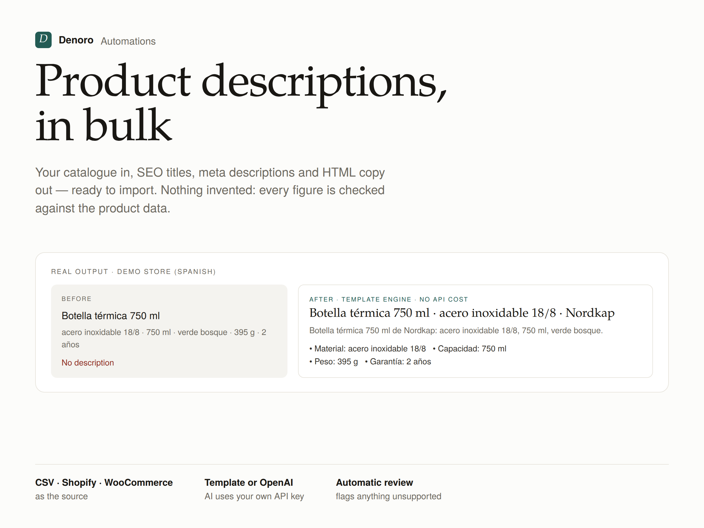
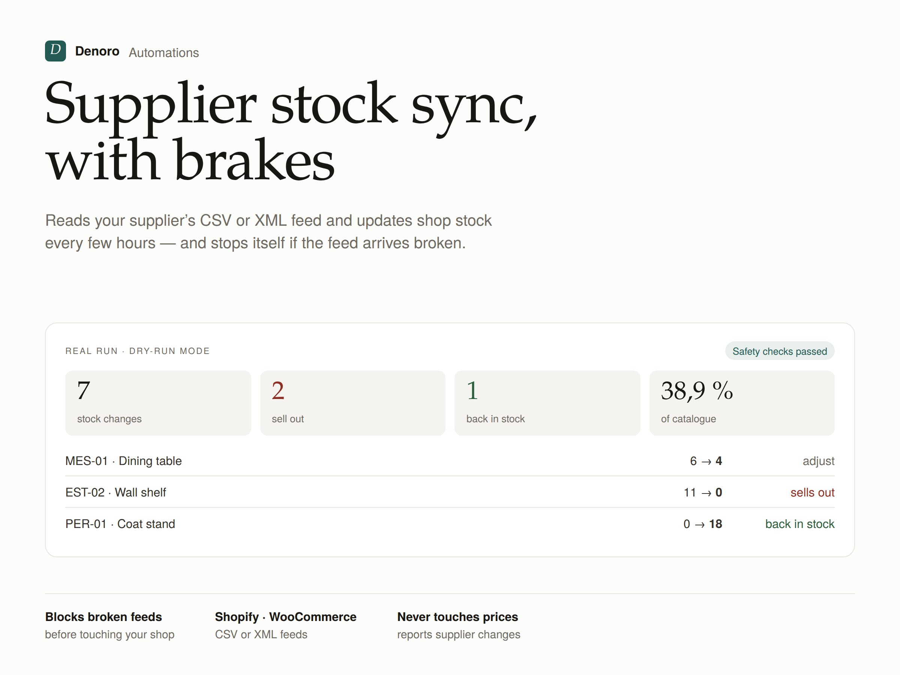
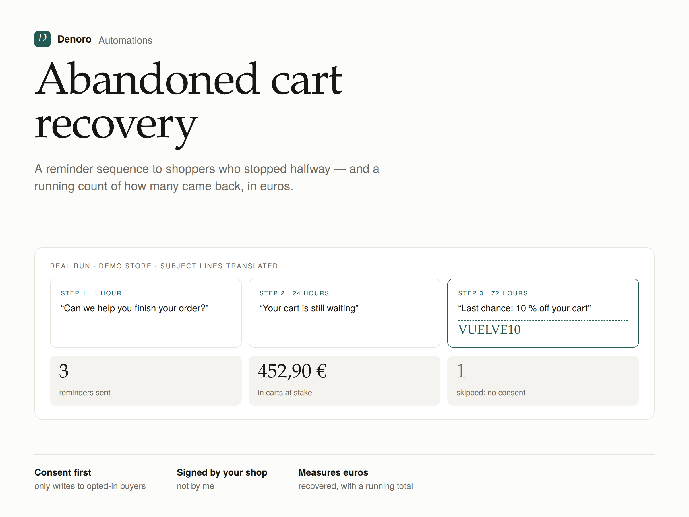
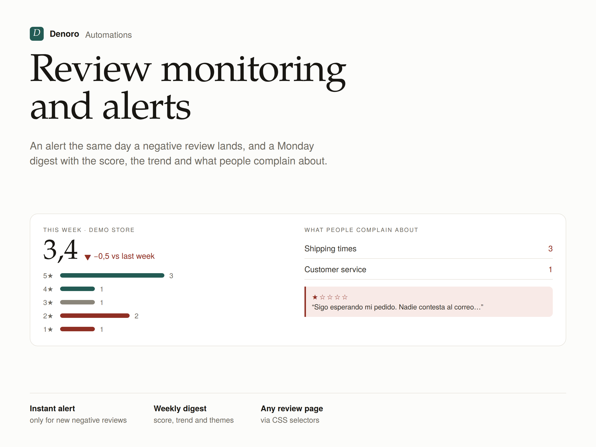
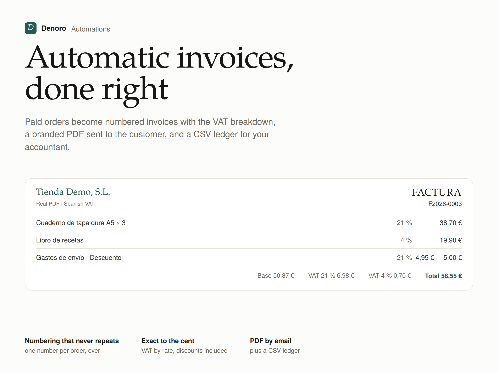
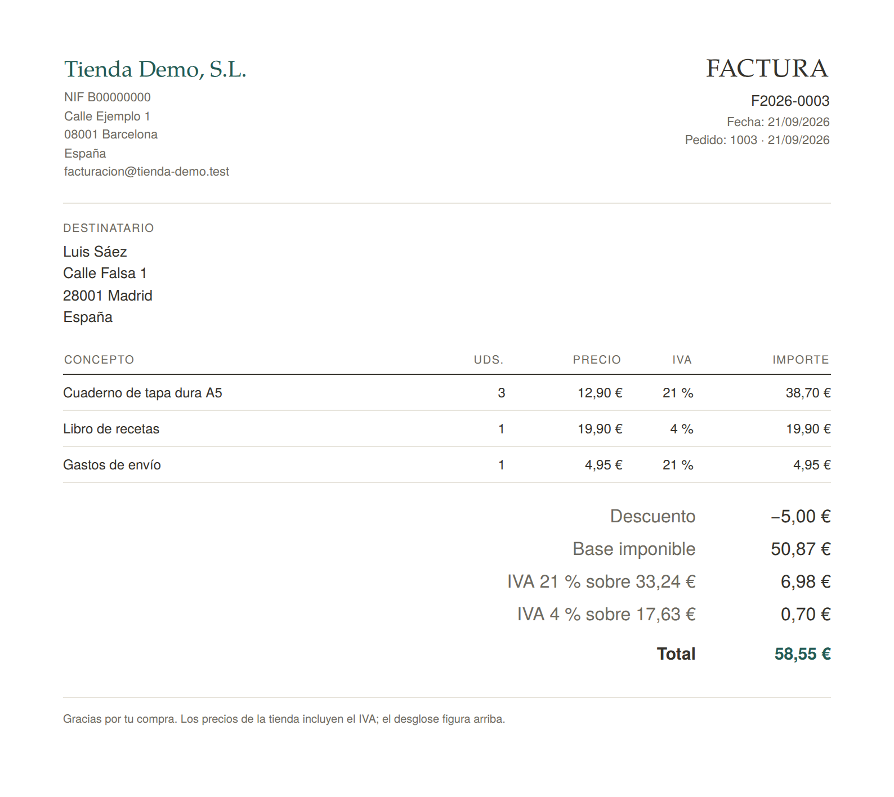

# E-commerce automations · Denoro

Five n8n automations for online shops, ready to set up. Each one ships with its workflow,
a demo mode that runs without connecting anything, its own tests and its documentation
(in Spanish, inside each folder). The other two in the catalogue live in their own repos:
[price-monitor](https://github.com/denoro-automations/price-monitor) and
[weekly-report](https://github.com/denoro-automations/weekly-report).

| Automation | What it does | Runs every |
|---|---|---|
| [Product copy in bulk](fichas-producto/) | Turns a catalogue with no copy into SEO titles, meta descriptions and HTML descriptions, ready to import. Free template engine, or OpenAI with your own key | Manual / Mondays |
| [Supplier stock sync](stock-proveedor/) | Syncs stock from the supplier's CSV or XML feed into Shopify or WooCommerce, and stops itself if the feed looks broken | 4 hours |
| [Abandoned carts](carritos/) | Reminder sequence to shoppers who opted in, signed by the shop, and a count of what comes back | 30 minutes |
| [Review monitoring](resenas/) | Same-day alert on every new negative review (WooCommerce reviews, or public pages whose robots.txt allows it), plus a Monday digest | 2 hours / Mondays |
| [Invoices and delivery notes](facturas/) | Numbering, VAT breakdown, branded PDF, sent to the customer, plus a CSV ledger. Not Verifactu-certified software | 1 hour |

## What the output looks like

The figures on each cover come from the workflow's own code run on its demo data; the invoice is a real PDF
produced by the workflow.

| | |
|---|---|
|  |  |
|  |  |
|  |  |

## How they are built

Every one follows the same pattern:

- **One configuration block.** Everything a client needs to touch lives in the *Configuración*
  node, commented. Nothing else in the workflow is meant to be edited.
- **Configuration is validated up front.** A placeholder address, a missing CSS selector or an
  impossible VAT rate stops the run with a message saying what to fix, instead of failing three
  nodes later.
- **Demo mode everywhere.** With `fuente: 'demo'` each workflow runs end to end with no shop
  connected — useful for demos and for testing changes.
- **Channels switch off by leaving them empty.** No `email_to`, no email. No `telegram_chat_id`,
  no Telegram.
- **Consistent branded emails.** Customer-facing mail (carts, invoices) is signed by the *shop*;
  internal digests by Denoro.
- **Failures are reported** through a shared error workflow, over email and Telegram.

## The JSON is generated, not hand-edited

Each Code node lives in `<automation>/src/*.js` and the workflow assembly in
`<automation>/build.py`, so the logic is reviewable in diffs and testable outside n8n.

```bash
python3 construir.py     # rebuild the 5 workflows + the error workflow
node probar.js           # validate the workflows and run all test suites
```

Tests run the node code outside n8n with a small harness that mimics `$input`, `$()` and
`$getWorkflowStaticData`.

## Install

1. In n8n: **Workflows → Import from File**, pick a `workflow.json`.
2. Import `comun/avisos-de-error.workflow.json` too and set it as the *Error workflow*.
3. Edit the `CONFIG` block, pick credentials, and try it in `demo` mode first.

PDF output (invoices) needs Gotenberg (without it, the invoice is sent as HTML):

```bash
docker run -d -p 3000:3000 --name gotenberg gotenberg/gotenberg:8
```

## About

Portfolio and working code by [Denoro Automations](https://denoroautomations.com/) —
n8n automation and web scraping for online shops.
